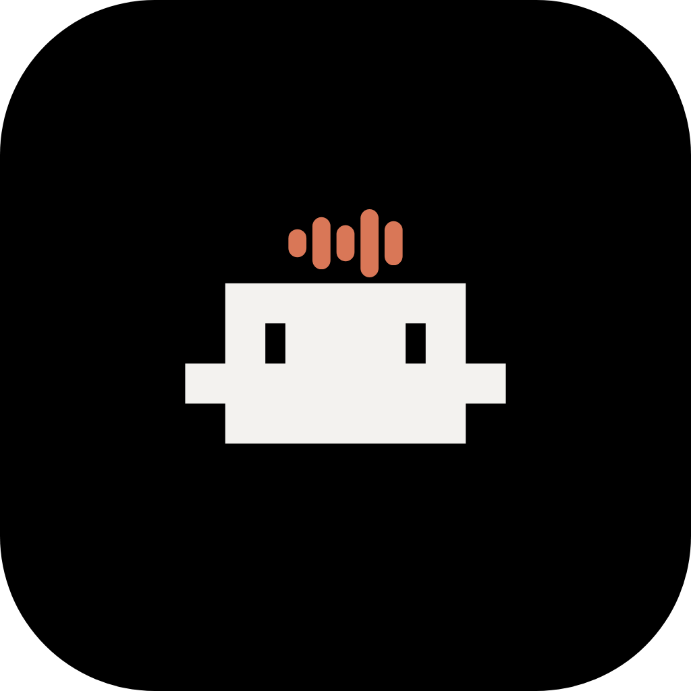
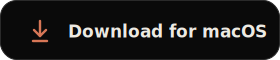
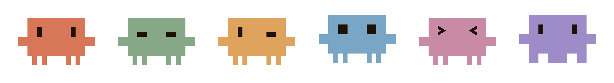

<div align="center">

<h1>&nbsp; Hey Claude</h1>

**A voice-activated launcher for [Claude Code](https://docs.anthropic.com/en/docs/claude-code) on macOS**

Because I got really, really tired of typing `claude` a hundred times a day ♡


> **Unofficial / community project.** Not affiliated with or endorsed by Anthropic.
> "Claude" is Anthropic's mark — this tool just borrows the wake phrase.

<br>

<a href="https://github.com/lilmelon77/hey-claude/releases/latest/download/HeyClaude.dmg"></a>

<sub>Notarized `.dmg` · Apple Silicon · macOS 14.4+ · no build required</sub>

<br><br>

<video src="https://github.com/user-attachments/assets/413dd66f-0e3a-4b98-bf32-70463bff8638" controls muted width="820"></video>

</div>

---

## What is this

I was typing `claude` into my terminal a hundred times a day, and one afternoon I thought, _what if I could just ask?_ So I taught my Mac to listen.

Say **"Hey Claude"** and it opens (or focuses) a Claude Code session, completely hands-free; follow the wake word with a question and it carries that straight in. A tiny **mascot lives in your notch** and blinks while it listens, thinks, and works. Everything runs **on-device** — your voice never leaves your Mac. ♡

### The good bits

- 🎙️ **Hands-free wake word** — Just say _"Hey Claude."_ No clicking, no hotkey needed.
- 🎚️ **Hold-to-talk** — Prefer a key? Hold one (default: Right ⌥), speak, release. **Esc** cancels. Fully reconfigurable.
- 🔒 **Private by default** — Wake word _and_ speech-to-text run entirely on your machine.
- 🪄 **Lives in your notch** — An interactive island that shows the voice state (idle · listening · thinking) and doubles as the control center: mute, switch where it opens, peek at recent launches.
- 🧩 **Opens where you work** — VS Code, Cursor, Antigravity, or your terminal (Terminal.app / iTerm2 / Ghostty).
- 🗣️ **Learns your voice** — Onboarding tunes the wake word to your own voice & accent.
- 🎨 **Make it yours** — Pick the notch mascot, its color, and idle animations in Settings.

---

## How it works

```
mic → wake word (KWS zipformer) → voice-activity detection → speech-to-text (Parakeet) → route
```

It's purely a **Claude Code** launcher — everything opens Claude Code in your chosen editor or terminal (auto-detected on first run, changeable in Settings). The only difference is whether you hand it a prompt:

| You say | What happens |
| --- | --- |
| **"Hey Claude"** | Opens or focuses a Claude Code session |
| **"Hey Claude, &lt;anything you want&gt;"** | …and carries what you said in as the prompt |

**Two ways to trigger it:** the **wake word** (hands-free; ends automatically when you stop talking), or **push-to-talk** — hold a key (default Right ⌥), speak, release. Push-to-talk has no silence detection, so pausing mid-thought never cuts you off, and **Esc** cancels. (It needs the Input Monitoring permission; the key is configurable in Settings.)

---

## Privacy

This is the part I care about most. The wake word and speech-to-text run **locally**, on-device. Your microphone audio is processed on your machine and is **not uploaded anywhere** by this app — no telemetry, no cloud wake word, no audio logged. The only thing that leaves your Mac is whatever **you** then send through Claude Code itself.

> **The honest fine print:** macOS may still show a mic-in-use indicator, and Claude Code — once launched — talks to Anthropic as it normally would. "On-device" refers to _this app's_ wake-word and transcription pipeline.

---

## Install

1. **[Download the latest `.dmg`](https://github.com/lilmelon77/hey-claude/releases/latest/download/HeyClaude.dmg)** ↑
2. Open it and drag **Hey Claude** into **Applications**.
3. Launch it and follow the short onboarding.

It's **notarized**, so it opens normally. **Requires** an Apple Silicon Mac on macOS 14.4+ and the [Claude Code CLI](https://docs.anthropic.com/en/docs/claude-code) (`claude`) on your `PATH`.

On first run macOS will ask for **Microphone** (required), **Input Monitoring** (only for push-to-talk), and **Automation** (the first time it opens your terminal/editor). Review them anytime in **System Settings → Privacy & Security**.

To uninstall: drag **Hey Claude.app** to the Trash, then optionally `rm -rf ~/Library/Application\ Support/HeyClaude`.

---

## Build from source

You don't need this to use the app — just grab the `.dmg` above. For contributors:

```bash
./scripts/fetch-sherpa.sh    # assemble the sherpa-onnx xcframework (not checked in — large)
./scripts/fetch-models.sh    # download the KWS + Parakeet models
swift run HeyClaudeApp        # build & run (compile check)
./scripts/bundle-app.sh       # assemble a real HeyClaude.app bundle
```

See **[CONTRIBUTING.md](CONTRIBUTING.md)** for the proper dev loop (`dev.sh`), stable signing, testing, and the load-bearing notes — `swift run` alone skips the `Info.plist`, so use `bundle-app.sh` / `dev.sh` to actually exercise the app.

---

## Contributing

Issues and PRs are very welcome — this is a small community project and I'd love the help. See **[CONTRIBUTING.md](CONTRIBUTING.md)** for setup, the dev loop, and wake-word debugging. Contributions are under GPL-3.0; please keep the unaffiliated-with-Anthropic framing intact.

## Third-party & licenses

This project's source is **GPL-3.0** (see [`LICENSE`](LICENSE)) — distribute a modified version and you must release your changes under the same license. Bundled and downloaded components keep their upstream licenses; see [`NOTICE`](NOTICE) for full attributions.

- **sherpa-onnx** ([k2-fsa](https://github.com/k2-fsa/sherpa-onnx)) — Apache-2.0, © Xiaomi Corporation; **ONNX Runtime** (Microsoft) — MIT.
- **Models** (KWS zipformer, Parakeet TDT) — from the sherpa-onnx model releases, under their upstream licenses.
- **Fonts** — _General Sans_ (© Indian Type Foundry, via [Fontshare](https://www.fontshare.com/fonts/general-sans)) isn't redistributable, so it's **not included**; the app falls back to the system font.

---

<div align="center">



_The little guy has moods. Pick a face and a color in Settings._

<br>

Made with 🩷 by **lilmelon77** · [GPL-3.0](LICENSE) © 2026

_Now go yell at your computer (nicely)_ ✿

</div>
