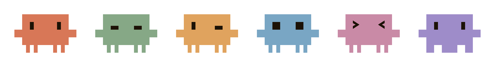

<div align="center">

<h1>&nbsp; Hey Claude</h1>

**A voice-activated launcher for [Claude Code](https://docs.anthropic.com/en/docs/claude-code) on macOS**

_Say the words, and a little guy in your notch gets to work_ ⊹ ࣪ ˖

Because I got really, really tired of typing `claude` a hundred times a day ♡


> **Unofficial / community project.** Not affiliated with or endorsed by Anthropic.
> "Claude" is Anthropic's mark — this tool just borrows the wake phrase.

<br>

<a href="https://github.com/lilmelon77/hey-claude/releases/latest"></a>

<sub>Notarized `.dmg` · Apple Silicon · macOS 14.4+ · no build required</sub>

</div>

---

## ⊹ What is this ⊹

Okay so, I was typing `claude` into my terminal approximately one million times a day, and one afternoon I thought, _what if I could just… ask?_

So I taught my Mac to listen. ꒰ ˶• ᵕ •˶ ꒱

Say **"Hey Claude"** and it opens (or focuses) a Claude Code session for you, completely hands-free. Follow the wake word with a question and it carries that straight in. And there's a tiny **mascot living in your notch** that blinks while it listens, thinks, and works, so you always know it's awake.

Everything runs **on-device**. Your voice never leaves your Mac. ♡

### The good bits

- 🎙️ **Hands-free wake word** — Just say _"Hey Claude."_ No clicking, no hotkey needed.
- 🎚️ **Hold-to-talk** — Prefer a key instead? Hold one (default: Right ⌥), speak, release. Pausing mid-thought never cuts you off, and **Esc** cancels. Fully reconfigurable.
- 🔒 **Private by default** — Wake-word detection _and_ speech-to-text run entirely on your machine; nothing leaves your device.
- 🪄 **Lives in your notch** — A little interactive island that shows the voice state (idle · listening · thinking) _and_ doubles as the control center: mute, switch where it opens, and peek at recent launches. (No menu-bar clutter!)
- 🧩 **Opens where you work** — VS Code, Cursor, Antigravity, or your terminal (Terminal.app / iTerm2 / Ghostty).
- 🗣️ **Learns your voice** — Onboarding tunes the wake word to your own voice & accent.
- ⚡ **Spoken prompts** — _"Hey Claude, &lt;question&gt;"_ sends it straight into Claude Code.
- 🎨 **Make it yours** — Pick the notch mascot, its color, and idle animations in Settings.

---

## How it works

```
mic → wake word (KWS zipformer) → voice-activity detection → speech-to-text (Parakeet) → route
```

It's purely a **Claude Code** launcher — everything opens Claude Code (in your chosen editor or terminal). The only difference is whether you hand it a prompt:

| You say                                     | What happens                                                      |
| ------------------------------------------- | ----------------------------------------------------------------- |
| **"Hey Claude"**                            | Opens or focuses a Claude Code session — no prompt, just launches |
| **"Hey Claude, &lt;anything you want&gt;"** | Opens Claude Code and carries what you said in as the prompt      |

### Two ways to start a capture

- **Wake word** — Say _"Hey Claude"_; voice-activity detection ends the capture automatically when you stop talking.
- **Push-to-talk** — Hold your hotkey (default: bare Right Option ⌥), speak, and release. There's **no VAD** on this path: the key release is the endpoint, so pausing mid-thought never truncates you. **Esc** cancels an in-flight hold. Requires the **Input Monitoring** permission; the key is configurable in Settings (Right ⌥ · Right ⌘ · ⌃⌥ · ⌥⌘ · fn).

### Opens where you work

Claude Code launches into the surface you actually use:

- **Editors** — **VS Code**, **Cursor**, or **Antigravity** (via the editor's Claude Code extension).
- **Terminals** — **Terminal.app**, **iTerm2**, or **Ghostty**.

On first run it detects the editor you're actively using and defaults to it (falling back to a terminal when the signal is ambiguous). You can change the target anytime in **Settings**.

---

## Privacy

This is the part I care about most. All wake-word and speech recognition happens **locally**, using on-device models (a streaming KWS zipformer for the wake word, Parakeet for speech-to-text). Your microphone audio is processed on your machine and is **not uploaded anywhere** by this app. The only thing that leaves your Mac is whatever **you** then send through Claude Code itself.

No telemetry. No cloud wake word. No audio logged or sent anywhere.

> **Caveat (the honest fine print):** macOS itself may still show a microphone-in-use indicator, and Claude Code — once launched — talks to Anthropic as it normally would. "On-device" refers to _this app's_ wake-word and transcription pipeline.

---

## Install

Most people just want the app:

1. **[Download the latest `.dmg`](https://github.com/lilmelon77/hey-claude/releases/latest)** ↑
2. Open it and drag **Hey Claude** into **Applications**.
3. Launch it from Applications (or Spotlight) and follow the short onboarding.

It's **notarized by Apple**, so it opens normally — no right-click-to-open workaround.

**Requirements:** an **Apple Silicon** Mac (M1 or newer) on **macOS 14.4+**, and the
[Claude Code CLI](https://docs.anthropic.com/en/docs/claude-code) (`claude`) on your `PATH`
(that's what it launches).

### Permissions it will ask for

Hey Claude is a voice app, so on first run macOS will prompt for:

- **Microphone** — required. The wake word and speech-to-text both listen here. Without it, nothing works.
- **Input Monitoring** — only if you use **push-to-talk** (the hold-a-key mode). The wake-word mode doesn't need it.
- **Automation / Accessibility** — the first time it opens your terminal or editor, macOS may ask permission to control that app.

You can review or change these anytime in **System Settings → Privacy & Security**. All of it is local — see [Privacy](#privacy) above.

### Uninstalling

Quit Hey Claude, drag **Hey Claude.app** from Applications to the Trash, and (optionally)
remove its data:

```bash
rm -rf ~/Library/Application\ Support/HeyClaude
```

---

## Build from source

For contributors and the curious. **You don't need this to use the app** — grab the `.dmg` above.

**Toolchain:** **Xcode Command Line Tools** (`xcode-select --install`) and the **Swift 6** toolchain, on macOS 14.4+ / Apple Silicon.

The ML model files and the prebuilt sherpa-onnx framework are **not** checked in (they're large and carry their own upstream licenses). Two scripts fetch them from pinned upstream releases:

```bash
# 1. Assemble the sherpa-onnx static xcframework (downloads + merges onnxruntime)
./scripts/fetch-sherpa.sh

# 2. Download the wake-word (KWS) and speech-to-text (Parakeet) models
./scripts/fetch-models.sh

# 3. Build and run the app
swift run HeyClaudeApp
```

To produce a distributable `HeyClaude.app` bundle:

```bash
./scripts/bundle-app.sh
```

By default the bundle is **ad-hoc signed** (works anywhere, but macOS won't persist microphone/automation permission grants across rebuilds). For a stable signature, set your Developer ID identity first:

```bash
export HEYCLAUDE_SIGN_ID="Developer ID Application: Your Name (TEAMID)"
./scripts/bundle-app.sh
```

> **Note:** `swift run HeyClaudeApp` launches the bare binary without an `Info.plist`, so the
> mic prompt, bundled fonts, and app icon are missing — fine for a compile check, but use
> `./scripts/bundle-app.sh` (or `./scripts/dev.sh`) to actually exercise the app. See
> [CONTRIBUTING.md](CONTRIBUTING.md).

### Developer tools

```bash
swift run heyclaude-selftest    # on-machine test harness (decode probes, wake sweeps)
swift test                      # XCTest suite (requires a full Xcode toolchain)
```

---

## Contributing

Issues and PRs are very welcome — this is a small community project and I'd love the help. ꒰ ˶ˆ ᵕ ˆ˶ ꒱ See **[CONTRIBUTING.md](CONTRIBUTING.md)** for setup, the dev loop, testing, and wake-word debugging. Contributions are under GPL-3.0, and please keep the unaffiliated-with-Anthropic framing intact.

## Third-party & licenses

This project's own source is licensed under **GPL-3.0** (see [`LICENSE`](LICENSE)) — if you distribute a modified version, you must release your changes under the same license. Bundled and downloaded components keep their respective upstream licenses; see [`NOTICE`](NOTICE) for full attributions.

- **sherpa-onnx** ([k2-fsa/sherpa-onnx](https://github.com/k2-fsa/sherpa-onnx)) — Apache-2.0, © Xiaomi Corporation. The Swift binding is adapted from upstream; the framework is fetched at build time. **ONNX Runtime** (Microsoft) — MIT.
- **Models** (KWS zipformer, Parakeet TDT) are fetched from the sherpa-onnx model releases under their respective upstream licenses.
- **Fonts:** The UI is designed in _General Sans_ (© Indian Type Foundry, free via [Fontshare](https://www.fontshare.com/fonts/general-sans)). Its license doesn't permit redistributing the font files, so they're **not included** here — the app falls back to the system font automatically. For the branded look, download General Sans from Fontshare and drop the `.otf` files into `Resources/Fonts/`.

---

<div align="center">



_The little guy has moods. Pick a face and a color in Settings._

<br>

Made with 🩷 by **lilmelon77** · [GPL-3.0](LICENSE) © 2026

_Now go yell at your computer (nicely)_ ✿

</div>
